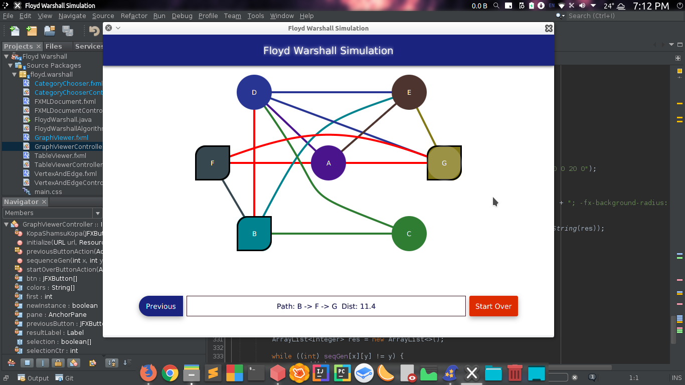
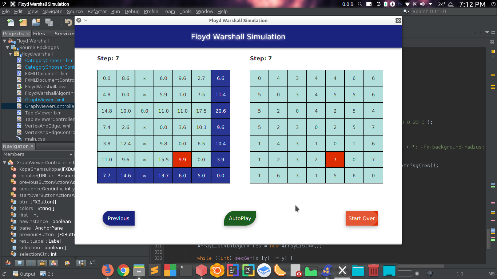

# Floyd Warshall Simulation
## A project to simulate Floyd Warshall Algorithm ##

**Graph Visualisation Sample:**

**Table Visualisation Sample:**

**Project Video:**
[https://www.youtube.com/watch?v=XbKaSStP02w&t=4s](https://www.youtube.com/watch?v=XbKaSStP02w&t=4s)

**Features:**

- Matrix Input
- Manual Input
- Distance Table
- Sequence Table
- Auto Play
- Graph Simulation

## CAUTION: ##

- THIS PROJECT IS DEVELOPED ON LINUX ENVIRONMENT USING NETBEANS IDE 8.2, JAVAFX
- INCLUDED JAR FILES SHOULD BE IMPORTED TO IDE(Location: /lib)
- RED COLORED EDGE SIGNIFIES BIDIRECTIONAL RELATIONSHIP
- ANY OTHER COLOR SIGNIFIES THAT EDGE IS STARTING FROM THE SAME COLORED VERTEX TO THE OTHER VERTEX
  (FOR EXAMPLE: THE EDGE BETWEEN B, E INDICATES A DIRECTION FROM B **TO** E IN FIRST SAMPLE PICTURE)
- BUGS COULD BE FOUND
